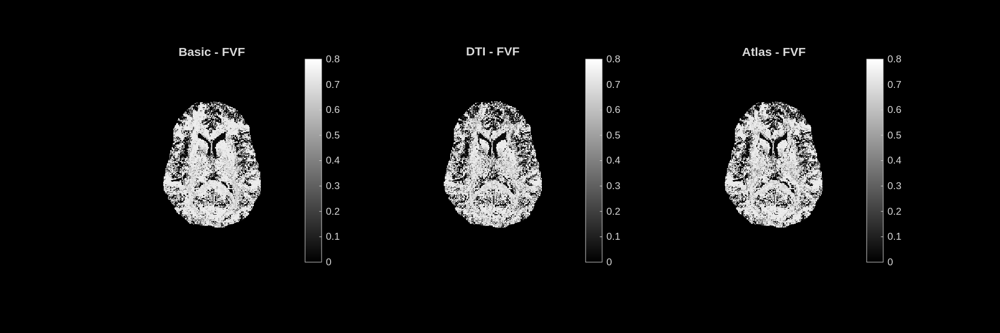
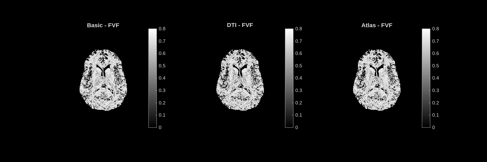

# FVF — Fiber Volume Fraction

**Unit:** fraction [0 – 0.8]  
**Interpretation:** Fraction of each voxel occupied by axon cylinders and their myelin sheaths combined. Represents the total fibre cross-section, not myelin alone.

## Stochastic dictionary

## Deterministic dictionary

---

## Analysis

FVF is uniformly high across most brain tissue (0.5–0.7), making the map appear near-white throughout. The **ventricles** stand out clearly as dark regions — there are no fibres in CSF.

The limited gray/white matter contrast in FVF at this slice is expected. FVF measures total fibre occupancy rather than myelination specifically, and at the dictionary level both gray matter and white matter voxels can be fitted with high FVF and varying MVF. The map therefore primarily distinguishes **tissue from CSF** rather than separating white matter tracts from cortex.

Both dictionaries produce similar FVF maps. This map is most useful in combination with MVF: a voxel with high FVF and high MVF is a densely myelinated fibre bundle, while high FVF with low MVF suggests lightly myelinated or unmyelinated axons.
