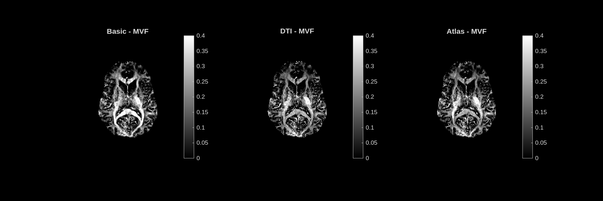
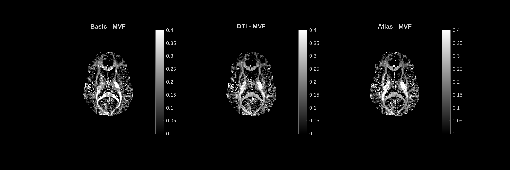

# MVF — Myelin Volume Fraction

**Unit:** fraction [0 – 0.4]  
**Interpretation:** Fraction of each voxel occupied by myelin. Brighter = more myelin.

## Stochastic dictionary

## Deterministic dictionary

---

## Analysis

The MVF map is the primary output of MIMM. It shows clear white matter anatomy: the **corpus callosum** (the bright arch running left–right across the centre), the **internal capsule**, the **corona radiata**, and posterior white matter tracts all appear bright, consistent with their known high myelin content. The **cortical gray matter** is uniformly darker, and the **ventricles** are black as expected — CSF contains no myelin.

All three modes (Basic, DTI, Atlas) produce nearly identical MVF maps. This is expected: MVF is primarily constrained by the magnitude signal decay and the QSM term, neither of which depends strongly on orientation. The orientation prior mainly affects theta_est and secondarily g_ratio.

The stochastic and deterministic dictionaries give very similar MVF values for this subject. Observed peak MVF ≈ 0.35–0.40 in the corpus callosum splenium, which is consistent with the literature (typical WM MVF 0.10–0.25 in most tracts, up to ~0.35 in the splenium).
