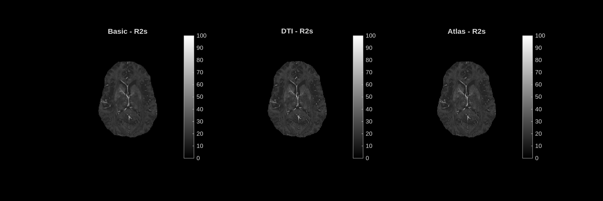

# R2s — Transverse Relaxation Rate

**Unit:** s⁻¹ [0 – 100]  
**Interpretation:** Rate of MRI signal decay in a gradient echo sequence. Higher R2* means faster decay, driven by iron content, myelin, and local susceptibility gradients.

## Stochastic dictionary

## Deterministic dictionary

---

## Analysis

The map appears dark overall because most brain tissue has R2* in the range **15–25 s⁻¹**, while the display scale extends to 100 s⁻¹. The scale is set wide to accommodate the full physiological range including deep gray matter and vessels.

The most prominent feature is a set of **very bright spots at venous structures** — large draining veins have extremely high R2* due to deoxyhemoglobin in blood. White matter is slightly brighter than cortical gray matter, consistent with the contribution of myelin and iron to R2*.

All three modes produce near-identical R2* maps. This is expected: R2* is directly estimated from the mGRE signal decay curve and is not sensitive to the orientation prior. It is the parameter most directly measured by the raw data, and the dictionary matching essentially recovers it back from the fitted signal.
