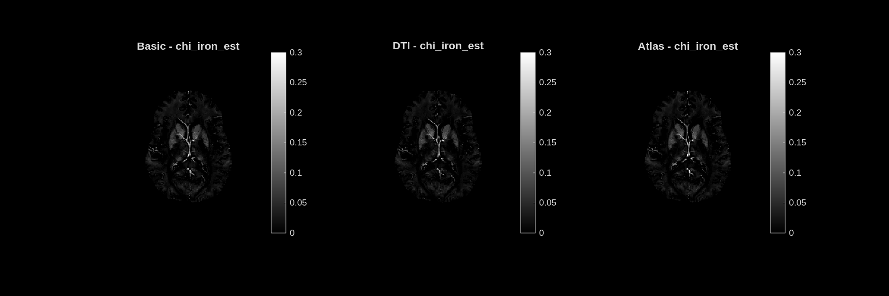

# chi_iron_est — Iron Susceptibility Contribution

**Unit:** ppm [0 – 0.3]  
**Interpretation:** Paramagnetic susceptibility contribution attributed to iron (ferritin, hemosiderin). Positive values; higher = more iron.

## Stochastic dictionary

## Deterministic dictionary

---

## Analysis

Most of the brain is near zero (dark), consistent with low iron content in white matter and cortex. Moderately bright regions are visible in the **central brain**, corresponding to the **basal ganglia** (globus pallidus, putamen) where iron naturally accumulates with age. Bright spots also appear at vascular structures.

MIMM separates iron from myelin susceptibility using the sign: iron is paramagnetic (positive chi) while myelin is diamagnetic (negative chi). The QSM input provides the total susceptibility, and MIMM attributes the positive component to iron and the negative component to myelin via the weighting factor `lambda_chi = 0.015`.

The map is quite dark and low-contrast because this particular slice (slice 80) is at a level where basal ganglia iron is visible but not at its peak. A more inferior slice would show stronger iron signal in the basal ganglia.
