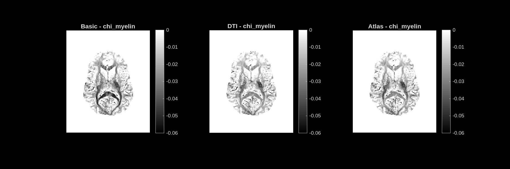
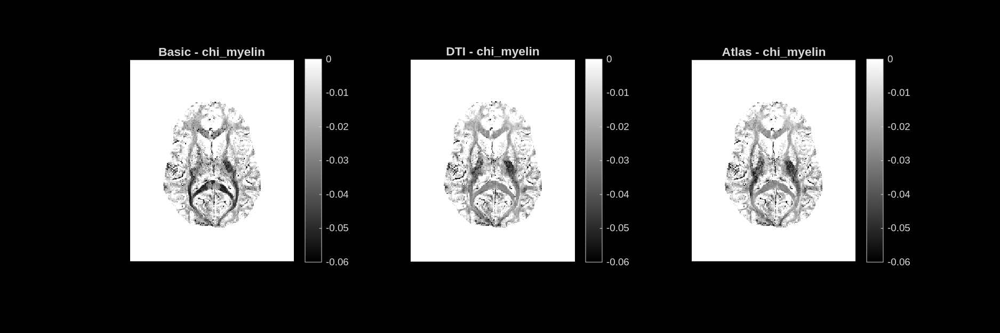

# chi_myelin — Myelin Susceptibility Contribution

**Unit:** ppm [−0.06 – 0]  
**Interpretation:** Diamagnetic susceptibility contribution from myelin. Negative values; more negative = more myelin. The sign is opposite to iron (chi_iron_est).

## Stochastic dictionary

## Deterministic dictionary

---

## Analysis

This is anatomically the **clearest and most detailed map** in the MIMM output. Because myelin is diamagnetic and the background/CSF has near-zero susceptibility, there is strong natural contrast between myelinated white matter (dark) and everything else (light).

The **corpus callosum**, **internal capsule**, and **posterior white matter tracts** are sharply delineated as dark structures. The ventricles appear white (no myelin contribution). Cortical gray matter sits at an intermediate level.

The map is essentially the myelin-weighted component of the QSM. It is closely related to MVF but reflects the susceptibility model rather than the volume fraction directly. Both stochastic and deterministic dictionaries produce very similar chi_myelin maps; the deterministic dictionary shows slightly sharper boundaries in some tracts.

All three modes (Basic, DTI, Atlas) give very similar chi_myelin, confirming this quantity is robustly estimated across orientation strategies.
