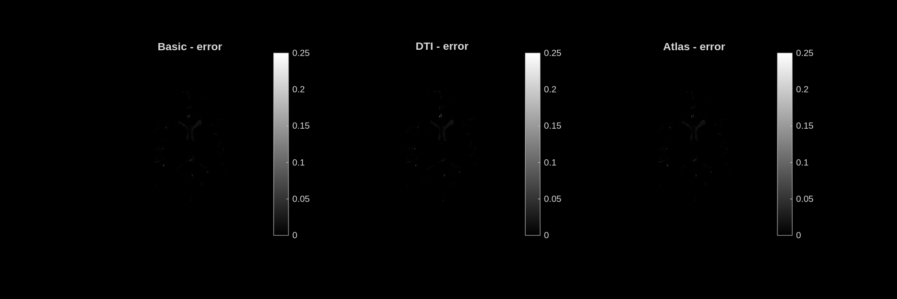

# error — Dictionary Matching Error

**Unit:** normalised residual [0 – 0.25]  
**Interpretation:** Normalised difference between the measured mGRE signal and the best-matching dictionary entry. Lower is better; values near zero indicate an excellent fit.

## Stochastic dictionary

## Deterministic dictionary

---

## Analysis

The error map is nearly black throughout, with essentially all brain voxels showing error values close to zero. This confirms that the biophysical dictionary adequately models the measured mGRE signal for this subject.

Very faint bright spots are visible at a few locations:
- **Ventricle edges** — partial volume effects where a voxel contains both CSF and tissue; the biophysical model assumes pure tissue.
- **Large vessel locations** — blood flow effects are not modelled by the dictionary.
- **Tissue–CSF interfaces** — the bounding box and brain mask may include borderline voxels.

The error is broadly similar across all three modes and both dictionaries, reflecting that all variants fit the data well within the brain mask. A higher-error region would suggest the dictionary is missing the relevant parameter combination for those voxels, which could point to pathology, unusual anatomy, or a need for a denser dictionary in that region of parameter space.
