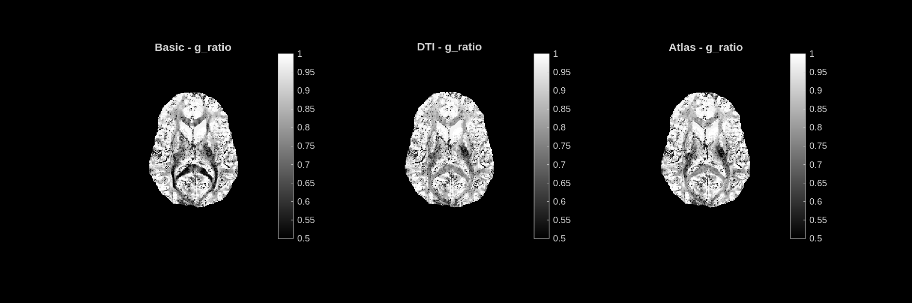
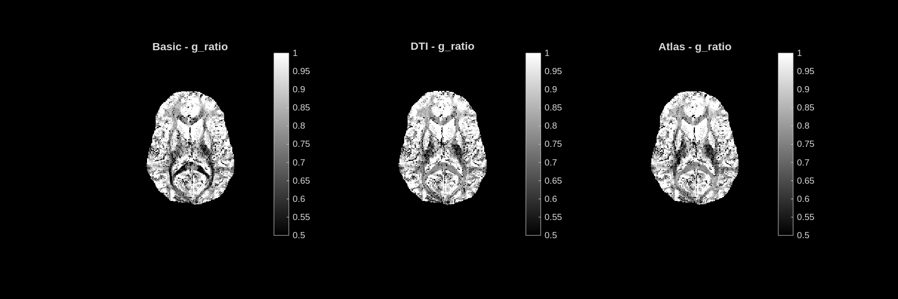

# g_ratio — Inner/Outer Axon Radius Ratio

**Unit:** dimensionless [0.5 – 1.0]  
**Interpretation:** Ratio of the inner axon radius to the total fibre radius (axon + myelin sheath). Lower = thicker myelin sheath; g_ratio = 1 means no myelin.

## Stochastic dictionary

## Deterministic dictionary

---

## Analysis

Most voxels show high g_ratio values (0.8–1.0), which is physiologically normal — the myelin sheath is thin relative to the total axon diameter. Darker patches within deep white matter tracts indicate regions with proportionally thicker sheaths and higher MVF.

The g_ratio map is noisier than MVF. This is because g_ratio is a derived quantity (it depends on the ratio of MVF to FVF), so small errors in both maps compound. The **stochastic dictionary** produces a smoother result due to its denser, randomly spread sampling of parameter space. The **deterministic dictionary** is visibly patchier, reflecting the coarser grid structure of its entries.

Gray matter regions correctly approach g_ratio ≈ 1, consistent with the near-absence of myelination in the cortex.
