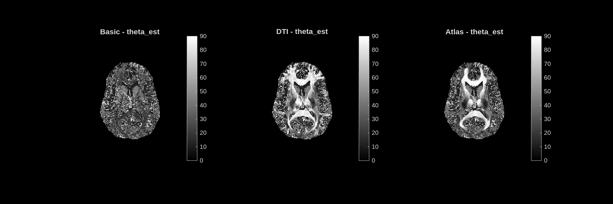
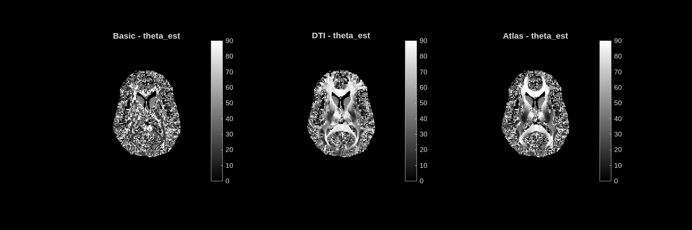

# theta_est — Estimated Fiber Orientation Angle

**Unit:** degrees [0 – 90°]  
**Interpretation:** Angle between the dominant fibre direction and the main magnetic field (B0). Affects the anisotropic susceptibility and relaxation of white matter in the biophysical model.

## Stochastic dictionary

## Deterministic dictionary

---

## Analysis

This is the map where the difference between MIMM modes is **most dramatic**, and it best illustrates why orientation information matters.

**Basic mode** (left panel): The orientation map is essentially random noise. Without a prior on fibre direction, the matching pursuit selects whatever angle minimises the local dictionary error independently in each voxel. The result has no spatial coherence and cannot be used anatomically.

**DTI mode** (middle panel): The map is spatially smooth and shows clear, coherent fibre tract anatomy. The **corpus callosum** appears with a consistent angle across its extent. Other tracts show smooth transitions in angle, matching the known fibre geometry of the brain. The structure is clean enough to be used for tract-specific analysis.

**Atlas mode** (right panel): Very similar to DTI — the atlas-derived orientation is a good population-level approximation of the subject-specific fibre orientation. In major tracts the two are nearly indistinguishable; minor differences may appear in regions where subject anatomy deviates from the atlas.

The stochastic and deterministic dictionaries show the same pattern: Basic is noisy, DTI and Atlas are coherent. The deterministic Basic map is slightly noisier than the stochastic Basic map, reflecting the coarser dictionary resolution.

The key practical message: **for any analysis that depends on theta_est (or on the orientation correction applied to MVF), the orientation-informed modes should be used**.
